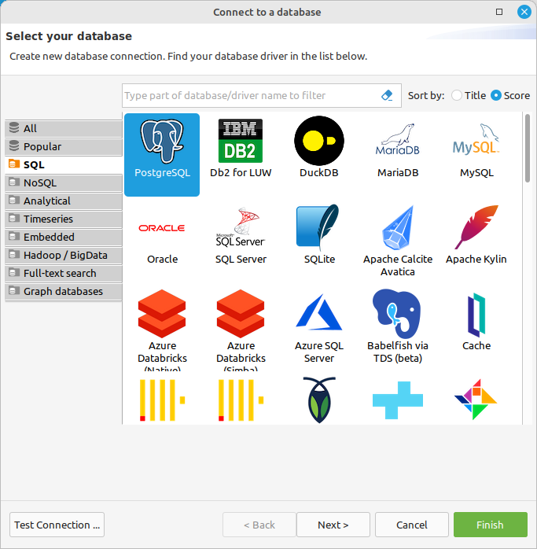
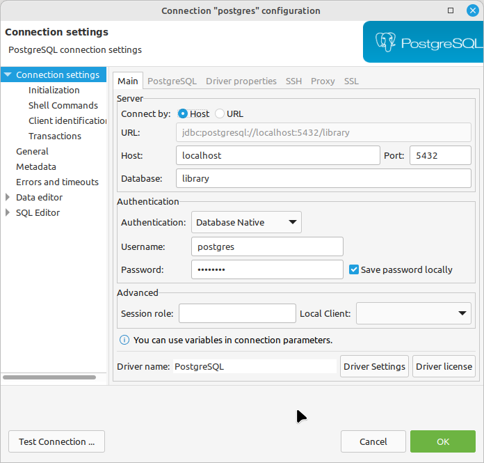

# Library backend

## Week 5

### Objective
* Introduce agile concepts
* Introduce Jira and Kanban
* Project topic description

### Homework
* Create Jira free account
* Create project Kanban board
* Select project topic
* Create Git repository for selected topic backend
* Create Git repository for selected topic frontend

#### Homework acceptance criteria
* Jira with project Kanban Board is created
* Git repository for project backend is created
* Git repository for project frontend is created

## Week 4

### Objective
* Introduce persistence layer
* Explain Spring Repository
* Explain JPA and Hibernate
* Connect application to DB using Hibernate

### Prerequisites
Docker is up and running (week3 homework)

### Homework
####  Using Customer and Address persistence as an example, implement persistence for following functionalities:

**Category**

```java 
public class CategoryEntity {
//  All fields from CategoryDetailDto
    
}
```

**Book**

```java 

public class BookEntity {
//  All fields from BookDetailDto
  
    // Unidirectional mapping
    @ManyToMany
    @JoinTable(name="category_book", 
               joinColumns=@JoinColumn(name="book_id"), 
               inverseJoinColumns=@JoinColumn(name="category_id"))
    private Set<Category> categories;
}
```

**Borrowing**

```java 
public class BorrowingEntity {
//  All fields from BorrowingDetailDto

  // Unidirectional mapping
  @ManyToOne
  private CustomerEntity customer;

  // Unidirectional mapping
  @ManyToOne
  private BookEntity bookEntity;
}
```

#### Homework acceptance criteria
* All code has to be present in a repository
* Application must be compilable and running


## Week 3
### Objective
* Docker and docker compose introduction
  * Explain docker and docker usecase 
  * Install docker on local machine
  * Test docker installation
    * > ```docker run hello-world```
  * Install docker-compose on local machine
* Introduce database IDE
  * Install DBeaver
  * Connect DBeaver to docker database instance. 


  


### Prerequisites
* None

### Homework
* Install docker and docker-compose on a local machine

#### Homework acceptance criteria
* docker and docker compose is running on a local machine
* Postgres DB is running in Docker using docker-compose
* DBeaver can connect to Docker Postgress instance

## Week 2

### Objective
* Basic Maven explanation.
  * Maven repository concept. Local and remote.
  * Basic build example with dependencies download.
  * mvn clean install
  * mvn spring-boot:run
  * Maven relation to IntelliJ IDE
* Explain application layering.
* Spring:
  * Introduce @Service annotation.
  * Explain Autowiring.
* Introduce and explain Swagger.

### Prerequisites
* Working WEEK1 homework code

### Homework
####  Using Customer service as an example, implement business logic (service) for following functionalities:
**Category**

```java 
package sk.umb.example.library.category.service;

public class CategoryService {
}
```

**Book**

```java 
package sk.umb.example.library.book.service;

public class BookService {
}
```

**Borrowing**

```java 
package sk.umb.example.library.borrowing.service;

public class BorrowingService {
}
```

#### For each functionality implement:
* Service backing methods for each of the Controller's API method.
* *DetailDto - placed in a service package.
* *RequestDto - placed in a service package.
* DTO properties: (If not mentioned, the request class does not contain an 'id' attribute)
  * Book detail
    * id 
    * authorFirstName
    * authorLastName
    * title
    * isbn
    * count (number of a given title in library)
    * categoryIds (One book can be listed in multiple categories)
  * Category detail
    * id
    * name
  * Borrowing detail
    * id
    * BookDetailDto
    * CustomerDetailDto
    * date (represent date of borrowing)
  * Borrowing request
    * bookId
    * customerId

#### Other
* Enable swaggers

#### Homework acceptance criteria
* For each service exists corresponding feature branch.
* Each feature branch is merged into main branch. (Use pull request for merging. Not mandatory however.).
* Application compiles and starts properly.
* Swagger is accessible.
* All services are implemented and functional using REST Api calls.

**Branching hint** 

Since borrowing detail partially depends on the implementation of Category, Book and Customer there are two options for dedicated borrowing feature branch.
  * Wait until the implementation of all dependencies are present in main branch, then fork the borrowing feature branch from the main.
  * Fork borrowing feature branch at the begining of the implementation, implement borrowing request (requestDto is independent of Customer and Book implementations), wait until the Customer and Book implementation are merged into the main branch, then backmerge the main branch into the borrowing feature branch.

## Week 1

### Objective
* Implement minimal Spring REST application
* Spring:
  * Describe Spring Framework
  * Describe Maven
  * Describe REST Api
  * Implement Customer Controller CRUD methods
  * update .gitignore
* Tools:
  * Introduce Postman.
    * Install Postman
    * Create Postman account
    * Demo Postman - Spring interaction

### Prerequisites
* Knowledge of Git and GitHub
* Installed software
  * Java 17
  * Maven

### Notes
* Put emphasis on code organization into packages.
* Put emphasis on naming convention

**Customer example:**

```java 
package sk.umb.example.library.customer.controller;

public class CustomerController {
}
```

### Homework
####  Using Customer controller as an example, implement controllers for following functionalities:

**Category**

```java 
// url: /api/categories

package sk.umb.example.library.category.controller;

public class CategoryController {
}
```

**Book**

```java 
// url: /api/books

package sk.umb.example.library.book.controller;

public class BookController {
}
```

**Borrowing**

```java 
// url: /api/borrowings

package sk.umb.example.library.borrowing.controller;

public class BorrowingController {
}
```

#### For each functionality implement methods

* List resource   / GET
* Retrieve detail / GET
* Create resource / POST 
* Update resource / PUT
* Delete resource / DELETE

#### Homework acceptance criteria

* Controller with correct name exist and is placed in corresponding package.
* For each controller exists corresponding feature branch.
* Each feature branch is merged into main branch. (Use pull request for merging. Not mandatory however.).
* Application starts without exceptions.
* Application logs (SYSOUT) request for each of the above REST API endpoints.
